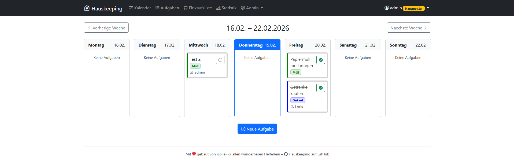

# 🏠 Hauskeeping

Eine moderne Web-Anwendung zur Verwaltung von Haushaltsaufgaben für Wohngemeinschaften, Familien oder Einzelpersonen.

---



---

## Features

- 📅 **Kalenderansicht als Hauptscreen** – Behalte alle Hausarbeiten im Überblick
- 🔄 **Wiederkehrende Aufgaben** – Setze Aufgaben wie „Einkaufen jeden Donnerstag" automatisch
- 🛒 **Interaktive Einkaufsliste** – Gemeinsam Artikel hinzufügen und abhaken
- 📋 **Aufgabenverwaltung** – Mit Tracking und Deadlines
- 👥 **Mehrbenutzer-Support** – Aufgaben auf Personen verteilen
- ✅ **Fortschrittstracking** – Erledigungshistorie auf einen Blick
- 🔔 **Benachrichtigungen** – E-Mail, Web Push (iOS PWA) und Android Push
- 📱 **Responsive Design** – Optimiert für Mobile & Desktop

---

## Tech Stack

| Bereich | Technologie |
|---|---|
| Backend | Flask (Python) |
| Frontend | Bootstrap 5 |
| Datenbank | PostgreSQL / SQLite |
| Push Notifications | pywebpush + VAPID |
| E-Mail | Flask-Mail (SMTP) |
| Scheduler | APScheduler / Celery Beat |
| Deployment | Raspbian / Linux |

---

## Hauptfunktionen

### 📅 Kalenderansicht
Zentrale Übersicht aller Haushaltsaufgaben in der Wochenansicht. Verschiedene Aufgabentypen werden farblich markiert.

### 🔄 Wiederkehrende Aufgaben
Flexible Wiederholungsregeln (täglich, wöchentlich, monatlich) mit automatischer Generierung zukünftiger Termine – z. B. „Einkaufen jeden Donnerstag" oder „Müll rausbringen jeden Montag".

### 🛒 Gemeinsame Einkaufsliste
Mehrere Benutzer können gleichzeitig Artikel hinzufügen und abhaken. Kategorisierung nach Lebensmittel, Haushalt, Drogerie usw. Artikel können direkt mit Einkaufs-Aufgaben verknüpft werden.

### 🔔 Benachrichtigungen
Hauskeeping unterstützt drei optionale Notification-Kanäle – alle standardmäßig deaktiviert und jederzeit in den Einstellungen verwaltbar:

- **E-Mail** – Wöchentliche Zusammenfassung mit offenen, überfälligen und bald fälligen Aufgaben (Standard: montags 07:00 Uhr)
- **Web Push (iOS)** – Echtzeit-Benachrichtigungen für iOS-User, die Hauskeeping als PWA installiert haben (erfordert iOS 16.4+, Safari, Homescreen-Installation)
- **Android Push** – Echtzeit-Benachrichtigungen direkt im Browser, ohne App-Installation (Chrome, Firefox, Samsung Internet)

Weitere Details: [Docs/architecture/Notifications.md](Docs/architecture/Notifications.md)

---

## Installation (Entwicklungsumgebung)

```bash
# Repository klonen
git clone https://github.com/iLollek/hauskeeping.git
cd hauskeeping

# Virtual Environment erstellen
python3 -m venv venv
source venv/bin/activate   # Linux/Mac
venv\Scripts\activate      # Windows

# Dependencies installieren
pip install -r requirements.txt

# Umgebungsvariablen konfigurieren
cp .env.example .env
# .env bearbeiten und anpassen

# Datenbank initialisieren
flask init-db

# Admin-Benutzer erstellen
flask create-admin

# App starten
python run.py
```

Die App ist nun unter `http://localhost:5000` erreichbar.

Erweiterte Deploymentguides für Produktivumgebungen können [hier](Docs/deployment/) eingesehen werden.

---

## Mitmachen

Hauskeeping ist ein Open-Source-Projekt und freut sich über Beiträge aus der Community.

- **Bugs melden** → [GitHub Issues](.github/Bug_Report_Template.md) · Issue-Typ: `type: bug`
- **Features vorschlagen** → [GitHub Issues](.github/Feature_Request_Template.md) · Issue-Typ: `type: feature`
- **Pull Requests** → Bitte vorher einen Issue abstimmen, um doppelte Arbeit zu vermeiden

Issues werden vom Maintainer [@iLollek](https://github.com/iLollek) nach dem **MoSCoW-Modell** priorisiert (`priority: must` → `priority: wont`). Weitere Infos zum Projektmanagement: [Docs/development/Priorisierung_Projektmanagement.md](Docs/development/Priorisierung_Projektmanagement.md)

---

## Lizenz

[MIT License](LICENSE) – Frei für private und kommerzielle Nutzung.